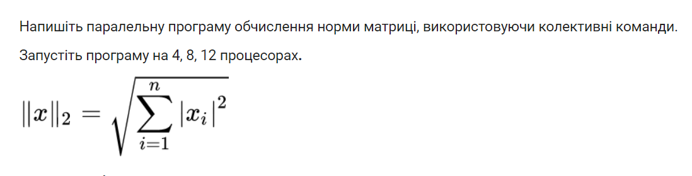
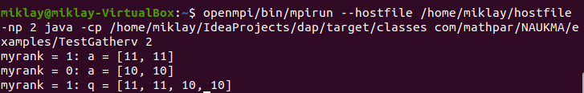
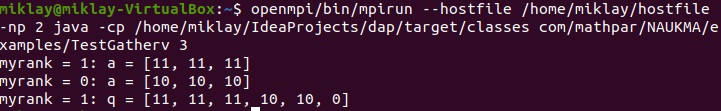
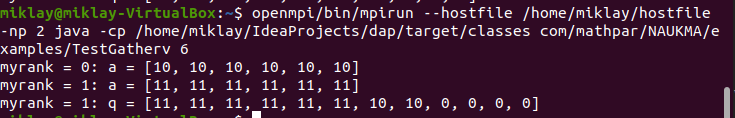

1)  Різниця між командами в тому, що allgather збирає усі дані з усіх
    процесорів й пересилає однаковий результат усім процесорам, на
    відміну від alltoallv, що розбиває дані на частини й відправляє
    відповідним процесорам. А також alltoallv дозволяє визначити
    потрібне розташування даних для відправлення, а також місця куди
    переміщують дані, для процесора що отримує.

2)  Нічого страшного не станеться просто останнє п'яте значення (index4)
    не буде передане ні до якого процесору.

3)  2

4)  Бо тоді це буде спрощена формула суми арифметичної послідовності,
    але оскільки в нас не змінюється d, то можна просто n\*np для
    знаходження розміру масиву, що утвориться.

5)  
    
    